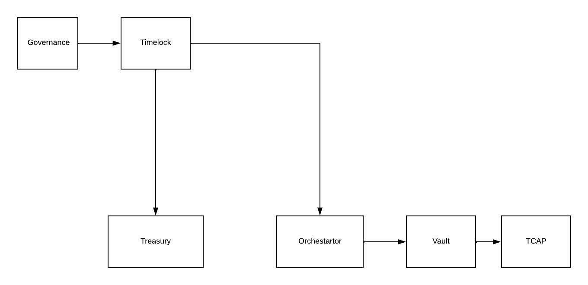
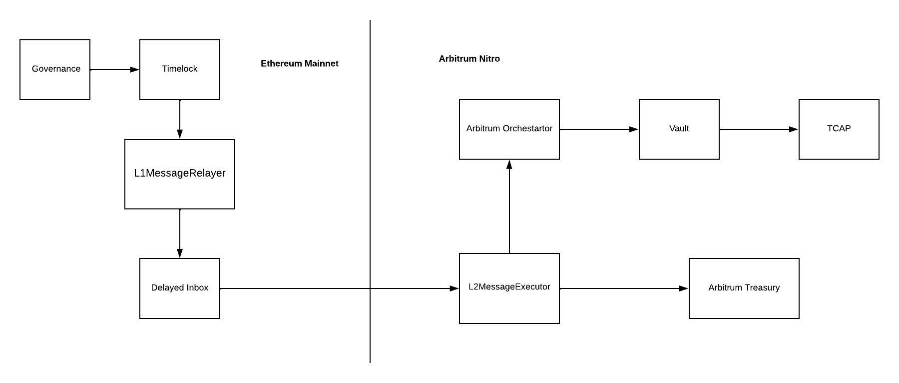

# Quantstamp Audit

### Mainnet Governance Architecture

- [GovernanceBeta.sol](../contracts/governance/GovernorBeta.sol): CTX holders can create proposals and vote on them
using the `GovernanceBeta` contract.
- [Timelock.sol](../contracts/governance/Timelock.sol): This contract is owned by the `GovernanceBeta` contract.
Once a proposal is approved it can be queued to the `Timelock` contract. The timelock ensures that the proposal is 
executed after a delay.
- [Orchestrator.sol](../contracts/Orchestrator.sol): This contract is owned by the `Timelock` contract. It acts an intermediary
for changing setting related to [Vaults](../contracts/IVaultHandler.sol) and [TCAP](../contracts/TCAP.sol).
Since it is owned by the timelock, calls to this contract can on;y be made through governance.
- [Treasury.sol](../contracts/ITreasury.sol): This contract is owned by the `Timelock` contract. It stores protocol fees.
Since it is owned by the timelock, calls to this contract can on;y be made through governance.

### Arbitrum Bridge Architecture

Architecture on arbitrum is very similar to the mainnet architecture. The orchestrator, vaults and TCAP will be 
deployed on arbitrum. However, the governance and timelock contract will remain on mainnet. This is because we want
the governance token CTX to be on mainnet.
This means that any proposal created on mainet needs to be relayed to arbitrum through a bridge.

The following contracts are part of the bridge mechanism:
- [L1MessageRelayer](../contracts/arbitrum/L1MessageRelayer.sol): This contract is owned by the timelock and is deployed by mainnet.
Only the timelock can make calls to this contract. It sends the message to arbitrum's `DelayedInbox` contract
to further relay it to arbitrum.
- [L2MessageExecutor](../contracts/arbitrum/L2MessageExecutor.sol): This contract is deployed on arbitrum and it has a check to ensure that
the message it received is from mainnet `L1MessageRelayer` contract. It then executes the message received.
- [ArbitrumOrchestrator](../contracts/arbitrum/ArbitrumOrchestrator.sol): This is the same contract as the orchestrator on mainnet.
However, messages can only be executed if they are sent by `L2MessageExecutor`.
- [ArbitrumTreasury](../contracts/arbitrum/ArbitrumTreasury.sol): This is the same contract as the treasury on mainnet.
However, messages can only be executed if they are sent by `L2MessageExecutor`.	

### Questions for quantstamp
- Is this [check](https://github.com/cryptexfinance/contracts/blob/5d51b66aba9e221d8e32aa5e43d9120eefb2a0fc/contracts/arbitrum/L2MessageExecutor.sol#L45-L48)
in `L2MessageExecutor` sufficient? Can someone bypass this check and execute any arbitrary message.
We don't know the complete details behind arbitrum's `DelayedInbox`. So just wondering if we've got these checks right.
- There's an external call [here](https://github.com/cryptexfinance/contracts/blob/5d51b66aba9e221d8e32aa5e43d9120eefb2a0fc/contracts/arbitrum/L2MessageExecutor.sol#L54)
that executes any arbitrary message received by `L2MessageExecutor`. Is this safe? Our assumption here is that this messages
will only be received by `L2MessageExecutor` if governance proposal is passed and executed. 
- Is our onlyOwner [check](https://github.com/cryptexfinance/contracts/blob/5d51b66aba9e221d8e32aa5e43d9120eefb2a0fc/contracts/arbitrum/ArbitrumOrchestrator.sol#L23-L29) for the
ArbitrumOrchestrator sufficient?
- Is our onlyOwner [check](https://github.com/cryptexfinance/contracts/blob/5d51b66aba9e221d8e32aa5e43d9120eefb2a0fc/contracts/arbitrum/ArbitrumTreasury.sol#L23-L29) for the
ArbitrumTreasury sufficient?
